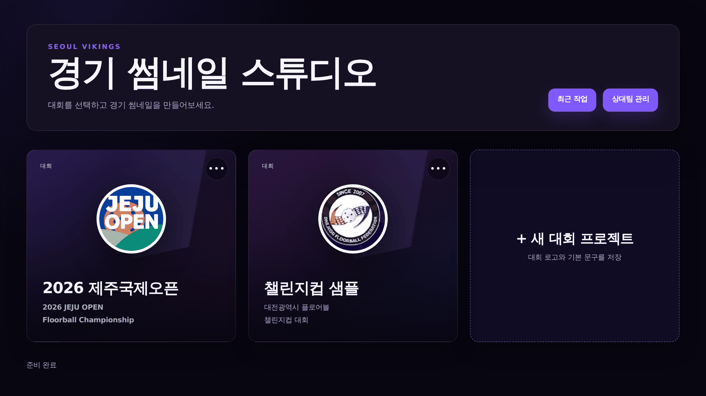
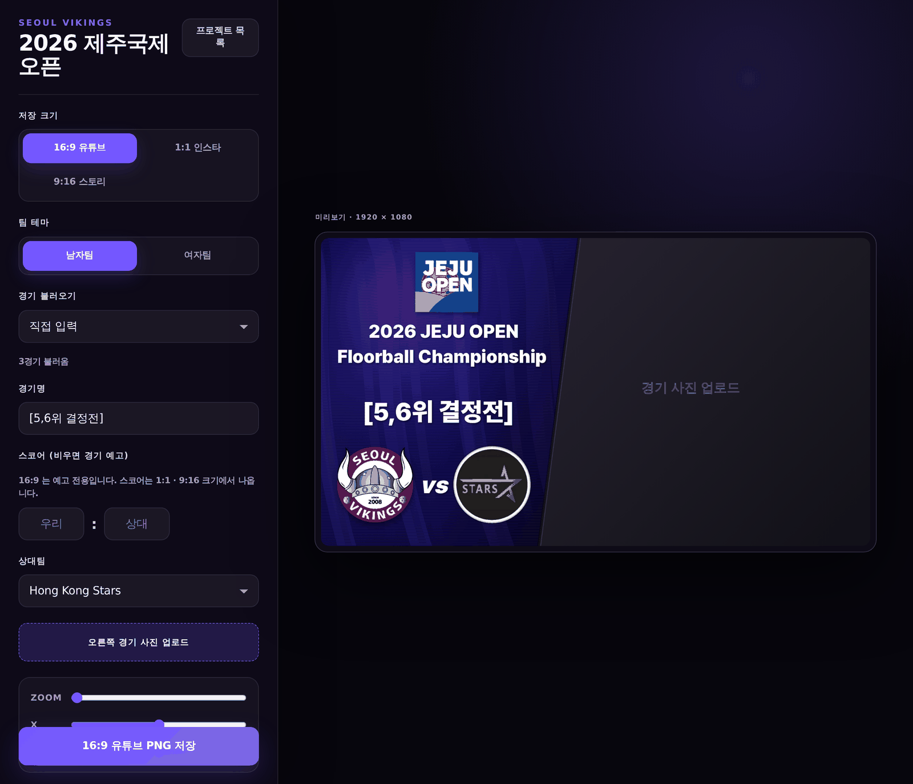

# Match Thumbnail Studio · 경기 썸네일 스튜디오

Preview and result graphics for floorball matches, made on a phone in about a
minute. Built for [Seoul Vikings](https://flovus.info), running on Cloudflare
Workers.

**<https://vikings.ludia0602.workers.dev>**



[English](#english) · [Korean](#korean)

---

## English

### What it is

A small web app for one job: making the thumbnail that goes with a match. You
register a tournament and its teams once. After that, making a graphic is
picking the match, adding a photo, and saving. Three sizes come out at once, for
YouTube, Instagram, and Stories.

The graphics usually have to be made between matches, on a phone, in a gym, so
the app is built to need as little input as possible at that moment.

### What it does

- **Tournament projects.** A tournament's name, logo, and two title lines are
  saved once. Every thumbnail for that tournament starts from them.
- **Opponent library.** Teams are stored with their crest and their division, so
  the men's theme only offers men's teams.
- **Schedule import.** Point a project at a [flovus.info](https://flovus.info)
  competition page and the editor lists that tournament's fixtures. Picking one
  fills in the match label and the opponent, and the score if the match is over.
- **Preview or result.** Leave the score empty and the card is a match preview.
  Enter a score and the same card becomes a result graphic.
- **Photo placement by hand.** Drag the game photo to reframe it, pinch to zoom
  between 1x and 2.4x. Sliders and a reset button are there for desktop.
- **Three sizes at once.** 16:9 for YouTube, 1:1 for the feed, 9:16 for Stories.
  Save one, or save all three together.
- **Logo repair on upload.** Crests exported from tournament sites often have a
  transparent interior, such as the inside of a badge ring or the space around
  lettering. Those enclosed areas are filled with white so fine details do not
  disappear against a dark panel.
- **Recent work.** The last 20 thumbnails are kept. Tapping one restores the
  tournament, opponent, match label, and score, so only the photo has to be
  added again.

### The three sizes have different jobs

| Size | Where it goes | Score |
| --- | --- | --- |
| 16:9 (1920×1080) | YouTube thumbnail | Not shown. Preview only |
| 1:1 (1080×1080) | Instagram feed | Shown, as `경기 종료` plus a scoreboard row |
| 9:16 (1080×1920) | Stories | Shown |

Most published sports result graphics divide the sizes this way. A score
stretched across a 16:9 frame leaves the middle of the card empty, so the wide
size stays a preview.

### Making one



1. Open the tournament from the home screen.
2. Choose the **men's** or **women's** theme. It changes the colours and the
   opponent list.
3. Pick a fixture under **경기 불러오기**, or type the match label.
4. Leave the score blank for a preview, or fill it in for a result.
5. Upload the game photo and drag it into place.
6. Save one size, or use **세 크기 한 번에 저장**.

On iPhone and iPad the images arrive through the share sheet, because Safari
will not download images this large directly. *Save Image* puts them in Photos.
Desktop browsers download them normally.

Text weight does not vary by device. Pretendard Black is bundled with the app
and the canvas waits for the font before drawing, so a thumbnail made on a phone
matches one made on a laptop.

### Setting up the next tournament

Everything except step 3 works from a phone.

**1. Create the project.** Home → **+ 새 대회 프로젝트**

| Field | Example | Notes |
| --- | --- | --- |
| 프로젝트명 | `2026 제주국제오픈` | Shown in the list |
| 대회명 1줄 | `2026 JEJU OPEN` | First line on the card |
| 대회명 2줄 | `Floorball Championship` | Second line. Keep it short; English runs long |
| 경기 일정 주소 | `https://flovus.info/competitions/6` | Optional. Enables the fixture picker |

The tournament logo is uploaded here as well. Any aspect ratio works, because it
is placed as-is rather than cropped to a circle.

**2. Add the opponents.** Home → **상대팀 관리**, then name, crest, and division.
The division drives the men's and women's filtering, so it needs to be right.

**3. Or seed a large field with the script.** The Jeju Open had 27 teams, too
many to enter by hand. Copy `scripts/seed-jeju.mjs` and edit the three
declarations at the top:

```js
const assetsDir = new URL("../public/assets/jeju/", import.meta.url).pathname; // logo folder
const PROJECT = { name, tournamentLine1, tournamentLine2, logo, fixtureUrl };   // the tournament
const TEAMS = [["Team name", "logo.webp", "men" | "women"], ...];               // the field
```

Put the crests in `public/assets/<tournament>/` and run:

```bash
node scripts/seed-jeju.mjs https://vikings.ludia0602.workers.dev
```

It skips projects and teams that already exist with a working logo, so it is
safe to run repeatedly. If the deployment cannot serve uploaded images yet, it
falls back to inlining them as `data:` URLs.

If you write a new seed script, update the `Sync Jeju tournament data` step in
`.github/workflows/deploy.yml` to call it. The defaults that bootstrap a
completely empty database, the Jeju Open and its teams, live in
`app/api/storage.ts`. New tournaments do not need to be added there.

### Deploying

GitHub → **Actions** → **Deploy** → **Run workflow**, then pick a branch. Pushing
to `main` runs the same workflow. No terminal required.

Repository secrets (Settings → Secrets and variables → Actions):

| Secret | Required | Permissions |
| --- | --- | --- |
| `CLOUDFLARE_API_TOKEN` | yes | Account → **Workers Scripts: Edit** and **D1: Edit** |
| `CLOUDFLARE_ACCOUNT_ID` | only if the token can reach several accounts | |

The workflow logs `wrangler whoami` and `wrangler d1 list` before deploying. If
it fails with `D1 binding 'DB' references database ... not found [code: 10181]`,
read those two outputs first. The usual cause is a token belonging to a
different Cloudflare account rather than a missing permission. The database is
looked up by name (`vikings-thumbnail-studio-db`), so recreating it does not
break the workflow.

From a terminal:

```bash
CLOUDFLARE_EXTERNAL_DEPLOY=1 \
CLOUDFLARE_DATABASE_ID=<d1 database id> \
npx vinext deploy
```

### Schedule import

`GET /api/fixtures?division=men&url=<flovus competition page>`

- Read server-side, because flovus sends no CORS headers and the browser cannot
  fetch it directly.
- Cached in D1 for ten minutes. If the tournament site is unreachable, the last
  successful copy is served.
- Only `flovus.info` addresses are accepted, so the endpoint cannot be used to
  fetch arbitrary URLs.
- Group stage only. The knockout bracket is rendered client-side on flovus, so
  there is nothing in the HTML to read. Those match labels are typed by hand.
- The parser is a pure function in `app/api/fixtures/parse.ts`, covered by
  `npm test`, including the case where we are the away team and the score has to
  be flipped.

### Running locally

```bash
npm install
npm run dev     # http://localhost:3000
npm run build
npm run lint
npm test        # fixture parser
```

Worth knowing:

- Local development simulates D1 through miniflare. Its data is separate from
  the deployment.
- If wrangler rejects a `compatibility_date` in the future, lower it in
  `wrangler.jsonc` temporarily, but do not commit that.
- Image bytes are stored in D1 as base64 text rather than BLOBs. Real D1 and the
  local simulator return BLOB columns differently, which once made every logo
  uploaded through the production site come back as an empty response. Storing
  images in D1 also means the app runs without an R2 bucket.

### Code map

| File | Responsibility |
| --- | --- |
| `app/thumbnail-studio.tsx` | The whole UI and the canvas rendering. Layout coordinates live in `VERTICAL_LAYOUTS` and `renderWide` |
| `app/api/storage.ts` | D1 schema and migrations, default tournament data, base64 encoding |
| `app/api/fixtures/parse.ts` | flovus HTML to fixture list (pure, tested) |
| `app/api/fixtures/route.ts` | Fetching, caching, and the host allow-list |
| `app/api/{projects,opponents,thumbnails,uploads,assets}` | Tournaments, opponents, history, images |
| `scripts/seed-jeju.mjs` | Registers a tournament and its teams on a deployed site |
| `scripts/resolve-d1.mjs` | Resolves the D1 database id by name, for deploys |
| `public/assets/jeju/` | Jeju Open crests |

When touching layout, check all three sizes. The 9:16 overlap, where the second
tournament line sat on top of the match label, was found while fixing the square
card's spacing.

### Ideas not built yet

- Share links for saved thumbnails
- Lineup and player-introduction templates
- A watermark or sponsor strip
- Knockout fixtures, which needs a way around flovus's client-side bracket
- Render snapshot tests, to catch the kind of overlap described above

---

## Korean

### 무엇을 하는 앱인가

경기에 쓸 썸네일을 만드는 앱입니다. 대회와 참가팀을 한 번 등록해두면, 이후에는
경기를 고르고 사진을 올린 뒤 저장하면 됩니다. 유튜브, 인스타그램, 스토리에 쓸 세
가지 크기가 한 번에 나옵니다.

썸네일은 대개 경기 사이에 체육관에서 폰으로 만들게 됩니다. 그래서 그 시점에
입력할 것을 최대한 줄이는 데 초점을 맞췄습니다.

### 기능

- **대회 프로젝트.** 대회 이름, 로고, 썸네일에 들어갈 문구 두 줄을 한 번 저장해
  둡니다. 그 대회의 모든 썸네일이 이 값에서 시작합니다.
- **상대팀 목록.** 팀마다 로고와 소속(남자부/여자부)을 함께 저장합니다. 소속이
  있어야 남자팀 테마에서 남자팀만 표시됩니다.
- **경기 일정 불러오기.** 대회에 [flovus](https://flovus.info) 대회 페이지 주소를
  넣어두면 편집 화면에 해당 대회의 경기 목록이 표시됩니다. 경기를 선택하면
  경기명과 상대팀이 채워지고, 이미 끝난 경기면 점수도 함께 들어옵니다.
- **예고와 결과.** 점수를 비우면 경기 예고, 점수를 입력하면 결과 카드가 됩니다.
- **사진 위치 조정.** 사진을 끌어서 원하는 위치로 옮기고, 두 손가락으로 벌려
  1배에서 2.4배까지 확대합니다. 데스크톱에서 쓸 슬라이더와 초기화 버튼도 있습니다.
- **세 크기 저장.** 유튜브 16:9, 피드 1:1, 스토리 9:16. 한 크기만 저장하거나 세
  크기를 한 번에 저장합니다.
- **로고 보정.** 대회 사이트에서 받은 로고는 배지 링 안쪽이나 글자 주변이 투명한
  경우가 많습니다. 그렇게 둘러싸인 투명 영역을 흰색으로 채워, 어두운 배경 위에서
  세부가 묻히지 않게 합니다.
- **최근 작업.** 만든 썸네일 20개가 남습니다. 선택하면 대회, 상대팀, 경기명, 점수가
  복원되므로 사진만 다시 올리면 됩니다.

### 크기마다 쓰임이 다릅니다

| 크기 | 쓰는 곳 | 점수 |
| --- | --- | --- |
| 16:9 (1920×1080) | 유튜브 썸네일 | 넣지 않습니다. 예고 전용 |
| 1:1 (1080×1080) | 인스타그램 피드 | 넣습니다. `경기 종료` 와 스코어보드 |
| 9:16 (1080×1920) | 스토리 | 넣습니다 |

실제로 발행되는 스포츠 결과 그래픽도 대체로 이렇게 나뉘어 있습니다. 16:9에 점수를
넣으면 가로로 늘어져 가운데가 비기 때문에, 가로 크기는 예고 전용으로 두었습니다.

### 만드는 순서


1. 홈에서 대회를 선택합니다.
2. **남자팀** 또는 **여자팀** 테마를 고릅니다. 색과 상대팀 목록이 함께 바뀝니다.
3. **경기 불러오기** 에서 경기를 선택하거나, 경기명을 직접 입력합니다.
4. 예고면 점수를 비우고, 결과면 점수를 입력합니다.
5. 경기 사진을 올리고 위치를 조정합니다.
6. 한 크기만 저장하거나 **세 크기 한 번에 저장** 을 누릅니다.

아이폰과 아이패드에서는 저장을 누르면 공유 시트가 뜹니다. 사파리가 이 크기의
이미지를 직접 내려받지 못하기 때문입니다. "이미지 저장" 을 누르면 사진 앱에
저장됩니다. 데스크톱 브라우저에서는 그대로 다운로드됩니다.

글씨 굵기는 기기에 따라 달라지지 않습니다. Pretendard Black 을 앱에 포함해두고
폰트가 준비된 뒤에 그리기 때문에, 폰에서 만든 결과와 노트북에서 만든 결과가
같습니다.

### 다음 대회 준비하기

3번을 제외하면 모두 폰에서 됩니다.

**1. 대회 프로젝트 만들기.** 홈 → **+ 새 대회 프로젝트**

| 칸 | 예시 | 메모 |
| --- | --- | --- |
| 프로젝트명 | `2026 제주국제오픈` | 목록에 표시되는 이름 |
| 대회명 1줄 | `2026 JEJU OPEN` | 썸네일 첫 줄 |
| 대회명 2줄 | `Floorball Championship` | 둘째 줄. 영문은 길어지므로 짧게 |
| 경기 일정 주소 | `https://flovus.info/competitions/6` | 선택 사항. 넣으면 경기 목록이 표시됩니다 |

대회 로고도 여기서 올립니다. 원형으로 자르지 않고 그대로 배치하므로 비율은
상관없습니다.

**2. 상대팀 등록.** 홈 → **상대팀 관리** 에서 이름, 로고, 소속을 입력합니다.
소속이 남녀 필터의 기준이 되므로 정확히 넣어야 합니다.

**3. 팀이 많으면 스크립트로.** 제주국제오픈은 참가팀이 27개라 손으로 넣기
어려웠습니다. `scripts/seed-jeju.mjs` 를 복사한 뒤 위쪽 세 줄만 고치면 됩니다.

```js
const assetsDir = new URL("../public/assets/jeju/", import.meta.url).pathname; // 로고 폴더
const PROJECT = { name, tournamentLine1, tournamentLine2, logo, fixtureUrl };   // 대회 정보
const TEAMS = [["팀 이름", "로고파일.webp", "men" | "women"], ...];             // 참가팀
```

로고는 `public/assets/<대회>/` 에 넣고 실행합니다.

```bash
node scripts/seed-jeju.mjs https://vikings.ludia0602.workers.dev
```

이미 있고 로고도 정상인 프로젝트와 팀은 건너뛰므로 여러 번 실행해도 됩니다.
배포본이 업로드한 이미지를 아직 제대로 돌려주지 못하는 상태면 `data:` URL 로
직접 심습니다.

새 시딩 스크립트를 만들었다면 `.github/workflows/deploy.yml` 의
`Sync Jeju tournament data` 단계도 그 파일로 바꿔야 합니다. 완전히 빈 데이터베이스를
처음 채우는 기본값, 즉 제주국제오픈과 참가팀은 `app/api/storage.ts` 에 있습니다.
새 대회를 여기에 추가할 필요는 없습니다.

### 배포

GitHub → **Actions** → **Deploy** → **Run workflow** 에서 브랜치를 고르고
실행합니다. `main` 에 푸시해도 같은 워크플로가 돌아갑니다. 터미널은 필요 없습니다.

저장소 시크릿은 Settings → Secrets and variables → Actions 에서 설정합니다.

| 시크릿 | 필수 | 권한 |
| --- | --- | --- |
| `CLOUDFLARE_API_TOKEN` | 필수 | Account → **Workers Scripts: Edit**, **D1: Edit** |
| `CLOUDFLARE_ACCOUNT_ID` | 토큰이 여러 계정에 연결된 경우에만 | |

워크플로는 배포 전에 `wrangler whoami` 와 `wrangler d1 list` 결과를 로그에
남깁니다. `D1 binding 'DB' references database ... not found [code: 10181]` 로
실패하면 이 두 출력을 먼저 확인합니다. 권한이 빠진 경우보다 토큰이 다른 계정
것인 경우가 많습니다. 데이터베이스는 ID 가 아니라 이름
(`vikings-thumbnail-studio-db`)으로 찾으므로, 데이터베이스를 다시 만들어도
워크플로를 고칠 필요는 없습니다.

터미널에서 배포할 때는 다음과 같습니다.

```bash
CLOUDFLARE_EXTERNAL_DEPLOY=1 \
CLOUDFLARE_DATABASE_ID=<d1 database id> \
npx vinext deploy
```

### 경기 일정 가져오기

`GET /api/fixtures?division=men&url=<flovus 대회 페이지>`

- flovus 가 CORS 헤더를 보내지 않아 브라우저에서 직접 부를 수 없으므로, 서버에서
  읽습니다.
- 받아온 일정은 D1 에 10분간 보관합니다. 대회 사이트가 응답하지 않으면 마지막으로
  받아둔 일정을 씁니다.
- `flovus.info` 주소만 허용합니다. 임의의 주소를 대신 요청하는 통로가 되지 않게
  하기 위해서입니다.
- 조별 예선만 나옵니다. 결선 대진표는 flovus 가 브라우저에서 그리기 때문에 HTML
  에는 읽을 내용이 없습니다. 8강부터는 경기명을 직접 입력합니다.
- 파싱은 `app/api/fixtures/parse.ts` 의 순수 함수가 담당하고 `npm test` 로
  검사합니다. 우리 팀이 원정일 때 점수를 뒤집는 경우도 포함되어 있습니다.

### 로컬에서 실행하기

```bash
npm install
npm run dev     # http://localhost:3000
npm run build
npm run lint
npm test        # 경기 일정 파서
```

몇 가지 알아둘 점:

- 로컬에서는 miniflare 가 D1 을 대신합니다. 배포본 데이터와는 별개입니다.
- wrangler 가 `compatibility_date` 를 미래 날짜라며 거부하면 `wrangler.jsonc` 의
  날짜를 잠시 낮춰 씁니다. 그 상태로 커밋하면 안 됩니다.
- 이미지 바이트는 D1 에 BLOB 이 아니라 base64 텍스트로 저장합니다. 실제 D1 과
  로컬 시뮬레이터가 BLOB 컬럼을 다르게 돌려줘서, 배포본에서 올린 로고가 전부 빈
  응답으로 돌아온 적이 있습니다. 이 방식 덕분에 R2 없이도 동작합니다.

### 코드 위치

| 파일 | 하는 일 |
| --- | --- |
| `app/thumbnail-studio.tsx` | 화면 전체와 캔버스 렌더링. 좌표는 `VERTICAL_LAYOUTS` 와 `renderWide` 에 있습니다 |
| `app/api/storage.ts` | D1 스키마와 마이그레이션, 기본 대회 데이터, base64 인코딩 |
| `app/api/fixtures/parse.ts` | flovus HTML 을 경기 목록으로 변환 (순수 함수, 테스트 있음) |
| `app/api/fixtures/route.ts` | 일정 가져오기, 캐시, 허용 주소 검사 |
| `app/api/{projects,opponents,thumbnails,uploads,assets}` | 대회, 상대팀, 기록, 이미지 |
| `scripts/seed-jeju.mjs` | 배포된 사이트에 대회와 참가팀 등록 |
| `scripts/resolve-d1.mjs` | 이름으로 D1 데이터베이스 ID 조회 (배포용) |
| `public/assets/jeju/` | 제주국제오픈 로고 모음 |

레이아웃을 수정할 때는 세 크기를 모두 확인해야 합니다. 9:16 에서 대회명 둘째 줄이
경기명 위에 겹쳐 있던 문제도 1:1 여백을 고치다가 발견했습니다.

### 아직 만들지 않은 것

- 저장한 썸네일 공유 링크
- 라인업, 선수 소개 템플릿
- 하단 워터마크 또는 스폰서 줄
- 결선 대진 자동 입력. flovus 가 브라우저에서 그리는 방식을 우회해야 합니다
- 렌더 스냅샷 테스트. 위에 적은 9:16 겹침 같은 문제를 자동으로 잡기 위한 것입니다

---

<details>
<summary>Left over from the starter template · 스타터 템플릿에서 딸려온 것들</summary>

This repository began as a [vinext](https://github.com/cloudflare/vinext)
starter. Still present, still unused:

- `app/chatgpt-auth.ts`, the Sign in with ChatGPT helpers (`getChatGPTUser()`,
  `requireChatGPTUser(returnTo)`). A starting point if team accounts are ever
  added.
- `db/schema.ts` and `drizzle.config.ts`, for Drizzle migrations. The live schema
  is created by `ensureSchema` in `app/api/storage.ts` instead.
- `examples/d1/`, the starter's D1 example surface.
- `.openai/hosting.json`, which declares the D1 and R2 bindings. R2 is not
  enabled.

</details>
